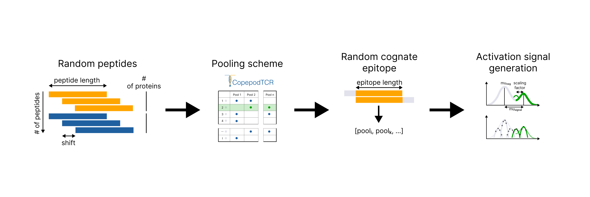
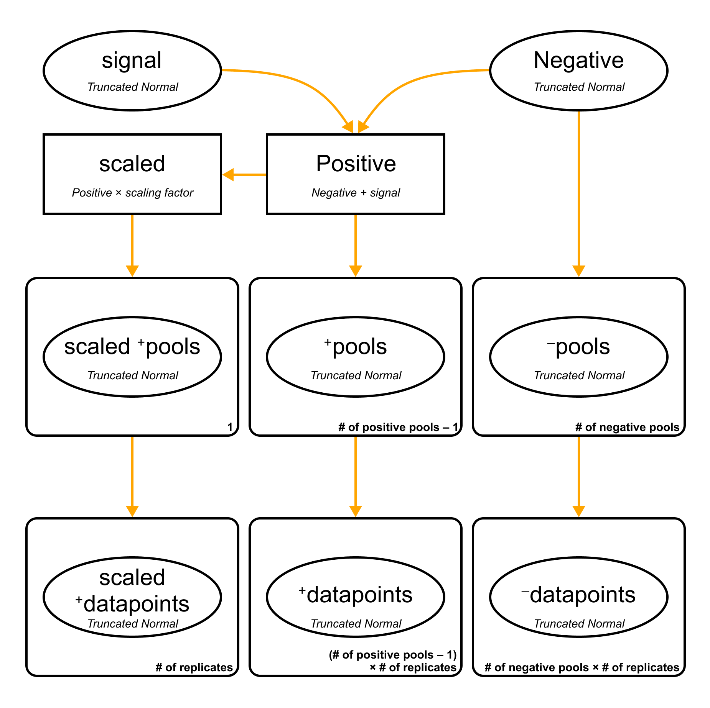
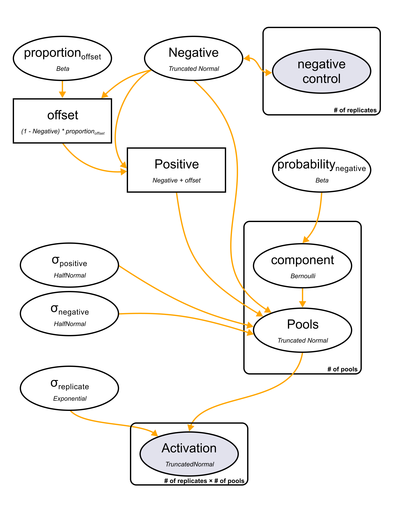

# *In silico* combinatorial peptide pooling assays

Details of the pipeline are described in the methods section of the «Identification of Antigen-Specific T Cell1 Receptors with Combinatorial Peptide Pooling»

This is snakemake pipeline with three steps.

1) Generation of CPP scheme and pooling peptides with entered parameters.

	- **n_pools**, number of pools
	- **len_lst**, number of peptides
	- **overlap**, shift between two overlapping peptides
	- **ep_length**, epitope length
	- **pep_length**, peptide length
	- **n_proteins**, number of proteins from which peptides are generated

2) Simulation of activation signal.

	
	

	- **mu_off**, $mu_{signal}$ for positive distribution
	- **sigma_off**, $sigma_{signal}$ for positive distribution
	- **sigma_p_r**, $sigma$ between replicates in positive pools
	- **sigma_n_r**, $sigma$ between replicates in negative pools
	- **low_offset**, scaling factor
	- **mu_n**, $mu_{neg}$ for negative distribution
	- **sigma_n**, $mu_{neg}$ for negative distribution
	- **r**, number of replicates
	- **error**, number of experimental errors (erroneously non-activated pools), if =100 => then all pools were non-activated

3) Activation model.

	
	